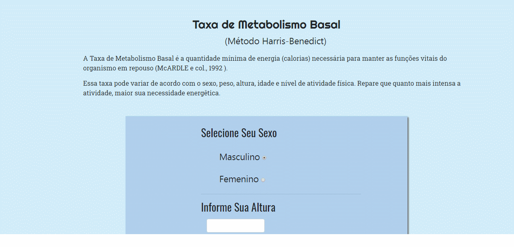

<head>
<meta charset="utf-8">
</head>
<h1 align="center">
 
 
Taxa de Metabolismo Basal
</h1>

Aplicação web para cálculo simples de TMB

  
  

 <h2>Features</h2> 
 

- ⚛️ **PHP** —  uma linguagem interpretada livre, usada originalmente apenas para o desenvolvimento de aplicações presentes e atuantes no lado do servidor, capazes de gerar conteúdo dinâmico na World Wide Web.  
- ⚛️ **Bootstrap 4** — Um framework para desenvolvimento de componentes de interface e front-end para sites e aplicações web usando HTML, CSS e JavaScript.

